# stackbase

An opinionated, reusable **project foundation** for a Go + Vue + Kubernetes stack —
local development and production run the *same* manifests, and live-reload works for
**both** Go and Vue out of the box.

Adopt it via GitHub **"Use this template"**, change two values, `make up`.

## Stack

| Layer        | Choice                                                              |
|--------------|--------------------------------------------------------------------|
| Backend      | Go — HTTP + middleware (request-id, logging, JWT-validate); gRPC later |
| Frontend     | Vue 3 + Vite                                                        |
| Database     | PostgreSQL (StatefulSet + idempotent migrate Job)                  |
| Analytics    | umami (one shared install, env-gated snippet)                      |
| Cluster      | MicroK8s, kustomize `base` + `overlays/{local,prod}`               |
| Dev loop     | [Tilt](https://tilt.dev) — sync source into the pod, live-reload   |
| Ingress      | **One shared Traefik** for the whole cluster; projects ship only an `IngressRoute` |

## Architecture

The request flow (Browser → `*.test` DNS → the shared Traefik → an `IngressRoute` splitting
`/` to Vue and `/api` to Go), the Tilt live-reload dev loop, and the same kustomize manifests
on local (`localhost:32000` `:dev`) vs prod (GHCR `:latest`):



> Interactive / editable version: [diagramzu](https://diagramzu.ai/s/66n7isyVzaVoFmCLDTXCGV) —
> re-export `docs/architecture.svg` from there when the diagram changes.

## Why it exists

Running several projects on one local MicroK8s box usually means a Traefik *per
project* fighting over port 80, hand-coordinated NodePorts, and a reverse proxy
demuxing `*.test`. stackbase makes the ingress controller **shared cluster infra**:
one Traefik owns `:80/:443` and routes by host across all namespaces. Adding a
project is one `kubectl apply` — no port to claim, no proxy to edit, no `/etc/hosts`.

And the local dev loop is real hot-reload: edit a `.go` file or a `.vue` file and the
change is live in the running pod in seconds. Only secrets and prod deploys are
manual (and those are `make` targets).

## Quick start

```bash
# 1. one-time per machine: install the shared Traefik (then add the printed *.test DNS line)
make cluster-init

# 2. set the two knobs (below): project namespace + <name>.test host

# 3. secrets, then optional analytics
cp secrets.env.example secrets.env                          # fill JWT_SECRET + POSTGRES_PASSWORD
make secrets-apply
cp services/frontend/.env.example services/frontend/.env    # optional: umami

# 4. dev loop
make up                   # tilt up — edit Go/Vue, live at http://<name>.test
```

MicroK8s users whose host `kubectl` isn't wired to the cluster: either
`microk8s config >> ~/.kube/config`, or run any target as
`make <target> KUBECTL="microk8s kubectl"`.

## The two knobs

A new project changes exactly two values:

| Knob      | Where                                                         | Default          |
|-----------|---------------------------------------------------------------|------------------|
| namespace | `infra/k8s/overlays/{local,prod}/kustomization.yaml` `namespace:` (+ `NS` in the Makefile) | `stackbase`      |
| host      | `infra/k8s/base/ingressroute.yaml` `` Host(`…test`) ``        | `stackbase.test` |

## Make targets

| Target               | What |
|----------------------|------|
| `make cluster-init`  | once per machine: install the shared Traefik; prints the `*.test` DNS line to add (see [`infra/cluster/dnsmasq.md`](infra/cluster/dnsmasq.md)) |
| `make secrets-apply` | build the `app-secrets` Secret from `secrets.env` |
| `make up` / `down`   | the dev loop (`tilt up`/`down`) — Go + Vue live-reload |
| `make apply`         | one-shot deploy of `overlays/local` without Tilt (guards against a non-local kube context) |
| `make migrate`       | (re)run DB migrations (ConfigMap from the `db/migrations` glob) |
| `make seed`          | seed demo data (`go run ./cmd/seed`); `make k8s-seed` runs it inside the api pod |
| `make deploy`        | prod: render `overlays/prod`, refuse on placeholder values, pin images to the git SHA, apply |
| `make prod-deploy`   | prod: build + push (`:latest` + `:<sha>`) then `deploy` |
| `make umami`         | optional: install the shared umami analytics |
| **day-2**            | `status` · `logs SERVICE=` · `shell SERVICE=` · `restart [SERVICE=]` · `events` · `validate [OVERLAY=]` · `diff [OVERLAY=]` · `health` |

Prod knobs: `GH_OWNER` / `REGISTRY` (image target), `PROD_KUBECONFIG` (targets a
specific cluster so a prod `make deploy` can't hit the wrong context).

**Secrets & config conventions**
- One `app-secrets` Secret, built from a gitignored `secrets.env` (`make secrets-apply`).
  Required keys: `JWT_SECRET`, `POSTGRES_PASSWORD`. Optional keys (MinIO/Discord for the
  prod backup) are read with `secretKeyRef … optional: true`, so leaving them blank never
  wedges a pod in `CreateContainerConfigError` — the feature just stays off.
- **A secret or ConfigMap change does *not* restart running pods.** After `make secrets-apply`
  (or editing config), run `make restart` (or `make restart SERVICE=api`) to pick it up.
- Prod Postgres backup: fill the MinIO keys in `secrets.env`, then `make prod-deploy` ships the
  `postgres-backup` CronJob (every 12h → MinIO, Discord alert on failure). Restore with
  [`infra/k8s/overlays/prod/backup/restore_script.sh`](infra/k8s/overlays/prod/backup/restore_script.sh).

`make umami` needs its own `umami` Secret first (it's referenced by the umami app and its
Postgres). Create the namespace + secret, then install:

```bash
kubectl create namespace umami
kubectl create secret generic umami -n umami \
  --from-literal=postgres-password=CHANGEME \
  --from-literal=app-secret="$(openssl rand -hex 16)"
make umami
```

Production: `make cluster-init` on the prod cluster once, fill `secrets.env`,
`make secrets-apply`, `make deploy`, `make migrate`.

## Status

✅ **Phase 1 complete** — Go api, Vue frontend, Postgres + glob migrations, kustomize
base + local/prod overlays, the Tilt dev loop (Go + Vue hot-reload verified), the shared
Traefik, and optional umami are all built and validated. Design spec:
[`docs/specs/2026-06-29-stackbase-foundation-design.md`](docs/specs/2026-06-29-stackbase-foundation-design.md).

> Note: on a box that already runs other projects, the shared Traefik can't take
> `:80` until those per-project Traefiks are retired (a separate cutover). Everything
> else — and the whole loop via Tilt port-forwards — works today.

Phase 2 (deferred): gRPC, prod CI (GHCR build/push), a full auth/user module.

## License

MIT
